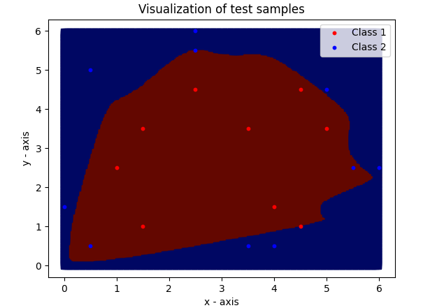

# Project Neural Network
Project work in the subject Artificial Intelligence.  
This application is a simple implementation of a neural network with variable input and hidden layer sizes. 
Some code changes have to be made to adjust the output layer size.  
The trained neural network can be stored as json.  
If there are only two input dimensions, the results can be visualized (see preview). 
Additionally the learning progress and loss are plotted. 

## Preview

## Versions and Libraries
Python 3  
matplotlib 3.5.2

## Group Members
Jens Dostal  
Sascha Dostal  
Alexander Hoetzel  
Benjamin Simon Taut  